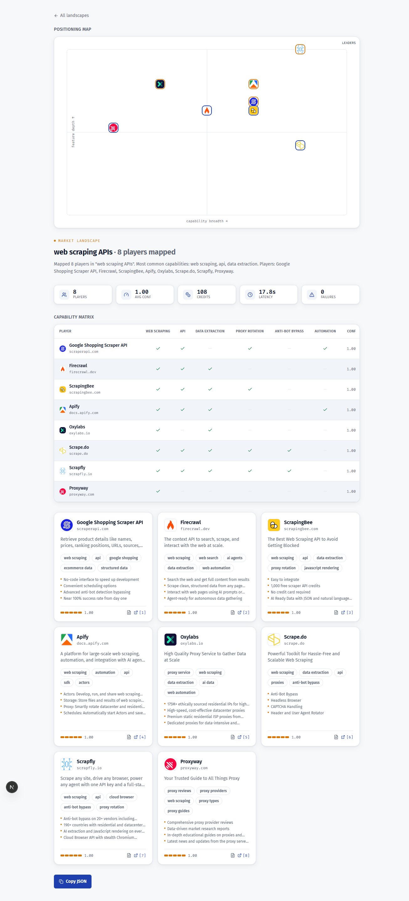

# context.dev Intelligence Monitor

Map a market — and watch it move. Type a **market category** → get an auto-built,
**cited, structured competitive landscape**: the players in that market, each with a typed
profile, a positioning map, a shared-capability comparison, a short brief, and an over-time
market-motion timeline — every claim evidence-linked to its source. Plus a pricing tracker,
an honest extraction report-card, and a Claude-Code agent-skill.

Webdog (by the context.dev team) tells you when a page changes — this tells you who the players
are and how the market moved. Pair them: map here, watch there.

Built on the [context.dev](https://context.dev?utm_source=contextdev-monitor&utm_medium=readme&utm_campaign=oss)
web-intelligence API.



---

## What's in here

| Tool | What it does |
|------|--------------|
| **Landscape Cartographer** | A category → a cited, structured `Landscape` (discover players → profile each → synthesize a comparison + brief). The web headline ("Map a market"). |
| **Public landscape pages** | Shareable, indexable `/landscape/<category>` pages with a **positioning map** — statically pre-rendered for a curated set, generated on-demand (and cached) for any other category. Every generated landscape gets a shareable `/landscape/<slug>` URL. |
| **Market motion timeline** | Snapshot history becomes a chronological market-motion feed: baseline, new entrants, exits, pricing moves, and capability changes for curated landscapes. |
| **Pricing tracker** | A competitor domain → a typed pricing snapshot + an evidence-cited diff ("what changed since last check"). |
| **Extraction report-card** | A reproducible, **honest** evaluation of how well context.dev extracts profiles — accuracy vs hand-checked truth, latency, cost/page, and a failure taxonomy. See [`core/REPORT-CARD.md`](core/REPORT-CARD.md). |
| **Agent-skill** | A Claude-Code skill (+ portable prompt) that runs the cartographer over context.dev's MCP server, with the `cartographer` CLI as the proven fallback. See [`skills/landscape-cartographer/`](skills/landscape-cartographer/). |

No accounts. No scrapers to maintain. No cron jobs. Clean dashboard UI with a light/dark toggle;
the API key never leaves the server.

---

## How it works

```
        web search ──► dedupe to ~8 players (drop aggregators/blogs)
                          │
                          ▼
        per player:  scrape markdown  +  structured extract  (context.dev API, server-side only)
                          │
                          ▼
        relevance gate (LLM category-fit if ANTHROPIC_API_KEY set, else heuristic) ──► synthesize: shared-tag comparison + brief + citations
                          │
                          ▼
        typed Landscape  (@contextdev/core) ──► Next.js 15 UI · /landscape pages · CLI · agent-skill
```

`core/` (`@contextdev/core`) is a framework-free engine: the context.dev client (retry/backoff,
budget gate, never-throw `Result<T>`), a credit ledger, content-hash cache, the landscape
pipeline (discover → profile → synthesize), the relevance gate, and the eval harness. `apps/web`
is a thin Next.js 15 UI over it — the API key is read only in server routes/actions.

### Honest evaluation (it's the point)

From the reproducible report-card: context.dev extracts **name + links ~100% correctly** and
captures the gist of one-liners, but its free-form **tags/features diverge from a curated
vocabulary** — so the comparison is *indicative*, not authoritative. Discovery is keyword-based,
so a relevance gate trims off-category false positives — and an optional **LLM category-fit gate**
(set `ANTHROPIC_API_KEY`) is much sharper than the word-overlap heuristic, while `--seed` lets you
force-include known players. Discovery still can't surface entities that aren't
companies-with-homepages (e.g. for "open source models" the real players are model *families* on
Hugging Face / GitHub) — a category-fit limit. The 5 API-contract gotchas we hit
(`/web/` path prefix, `GET` scrape, `.data` unwrap, no `null` in a JSON-schema enum, per-result
search billing) are documented and handled in `core/`. Full numbers + methodology:
[`core/REPORT-CARD.md`](core/REPORT-CARD.md).

---

## Architecture

One repo, **npm workspaces** — two real packages plus a couple of plain folders:

```
contextdev-monitor/              # root: workspace glue only (workspaces: ["core","apps/*"])
├── core/      →  @contextdev/core   # THE ENGINE — framework-free TypeScript (deps: zod only).
│   └── src/      context.dev client · credit ledger · landscape pipeline
│                 (discover → profile → synthesize) · relevance + optional LLM gate ·
│                 the report-card eval · the `cartographer` CLI.
├── apps/web/  →  web                 # THE UI — Next.js 15.  A thin shell over the engine;
│                 the API key is read only in server routes.  depends on it: "@contextdev/core": "*"
├── skills/landscape-cartographer/    # NOT a package — just SKILL.md / PROMPT.md / EXAMPLE.md
│                                     # (a Claude-Code agent-skill that points at core's CLI)
└── docs/                             # the README screenshot
```

**`core` is the brain; everything else is a face on it.** The web app, the `cartographer` CLI,
the report-card eval, and the agent-skill all drive the *same* engine — so you can map a category
from a browser, a terminal, CI, or an AI agent without dragging a web framework along.

**No build step for `core`.** Its `package.json` `exports` points straight at `./src/index.ts`
(raw TypeScript), and `apps/web/next.config.mjs` sets `transpilePackages: ["@contextdev/core"]`
+ an `extensionAlias` (`.js`→`.ts`), so Next compiles the app **and** core's TS together in one
pass. The CLI and tests run the TS directly via `tsx`/`vitest`. That's why one `npm install` +
one `npm run dev` boots everything — the package split is invisible at runtime, it just lets the
engine be reused outside the UI.

| Command | Runs |
|---|---|
| `npm install` (root) | installs both workspaces; symlinks `core` into `apps/web` |
| `npm run dev -w apps/web` · `next build` | the web UI **+ core's TS inline** (no separate core build) |
| `npm run cartographer -w core` · `npm run test -w core` | core's TS directly via `tsx`/`vitest` |

Plain npm workspaces — no Turborepo, no extra bundler beyond Next.

---

## Run locally

Requires Node 20+. Install (npm workspaces — installs `core` + `apps/web`):

```bash
npm install
```

Add your context.dev key (server-only):

```bash
cp apps/web/.env.example apps/web/.env.local
# then edit apps/web/.env.local and set CONTEXTDEV_API_KEY=<your key>
```

Optional: durable cache for on-demand landscapes. Set `KV_REST_API_URL` and
`KV_REST_API_TOKEN` (Vercel KV / Upstash) and shared maps survive cold starts.
Without them, share links use the session-lifetime in-memory cache.

Start the web app (the workspace lives at `apps/web`):

```bash
npm run dev -w apps/web
```

Open **http://localhost:3000** — "Map a market" is the default mode; curated landscape pages live
at `/landscape`.

### CLI & evaluation

```bash
# Map a category from the terminal (the agent-skill's fallback):
CONTEXTDEV_API_KEY=<key> npm run cartographer -w core -- "web scraping APIs" --max 8 --json out.json

# Force-include a known player you want in the map (repeatable):
CONTEXTDEV_API_KEY=<key> npm run cartographer -w core -- "custom agent harness" --seed pi.dev

# Set ANTHROPIC_API_KEY too and an LLM category-fit gate sharpens relevance
# (drops keyword false positives like a closed vendor in an "open source" category):
ANTHROPIC_API_KEY=<key> CONTEXTDEV_API_KEY=<key> npm run cartographer -w core -- "open source models"

# Add a curated SEO landscape page (writes apps/web/data/landscapes/<slug>.json):
CONTEXTDEV_API_KEY=<key> npx tsx apps/web/scripts/gen-landscapes.ts "headless CMS"

# Regenerate the honest extraction report-card from a live run:
CONTEXTDEV_API_KEY=<key> npm run report-card -w core -- --collect
```

#### Watch a market on autopilot

Fork the repo, enable GitHub Actions on the fork, then add `CONTEXTDEV_API_KEY` under
**Settings -> Secrets and variables -> Actions**. `ANTHROPIC_API_KEY` is optional. Edit
`apps/web/lib/landscape-catalog.ts` to choose the curated markets; the weekly Action
re-maps those categories, commits refreshed snapshots/history, and opens an issue when
the market diff has confirmed movement. Budget about 105cr per category per week.

### Tests

```bash
npm run test -w core                                    # core engine
npm run test -w apps/web -- --poolOptions.threads.maxThreads=1   # web (single-threaded: the default pool can OOM)
```

**Deploy to Vercel:** import the GitHub repo, set the project's **Root Directory to `apps/web`**
(Vercel detects Next.js there and auto-installs the npm workspace from the repo root), add
`CONTEXTDEV_API_KEY` as a server-only env var (do **not** prefix with `NEXT_PUBLIC_`), and deploy.
Optional: set `KV_REST_API_URL`/`KV_REST_API_TOKEN` (Vercel KV / Upstash) so generated
`/landscape/<slug>` share links survive cold starts. Every push then auto-deploys.

---

## Demo vs BYO-key

| Mode | How |
|------|-----|
| **Demo** | Uses the maintainer's context.dev key, subject to daily caps. On-demand landscape generation flows through this budget (bounded spend); when a cap is hit the UI shows a bring-your-own-key CTA. |
| **BYO-key** | Paste your own [context.dev](https://context.dev?utm_source=contextdev-monitor&utm_medium=readme&utm_campaign=oss) key in the UI — sent to the server route per request, **never stored** (not in localStorage, not in a database). |

---

## Agent-skill

[`skills/landscape-cartographer/`](skills/landscape-cartographer/) ships a Claude-Code skill that
maps a category over context.dev's MCP server (CLI fallback), emitting the same typed `Landscape`.
Copy the folder into `~/.claude/skills/`, or use the paste-in
[`PROMPT.md`](skills/landscape-cartographer/PROMPT.md) with Cursor/Cline. A real worked example +
evaluation is in [`EXAMPLE.md`](skills/landscape-cartographer/EXAMPLE.md).

---

## Powered by context.dev

Built on the [context.dev](https://context.dev?utm_source=contextdev-monitor&utm_medium=readme&utm_campaign=oss)
API for structured web extraction. Grab your own key at **context.dev** to run unlimited maps.

## License

[MIT](LICENSE) — © 2026 Aditya Chaudhary
